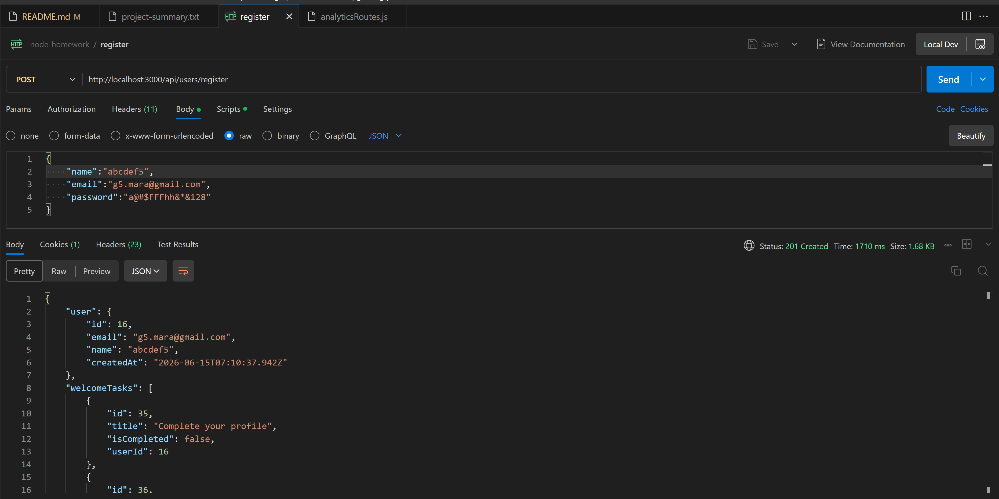
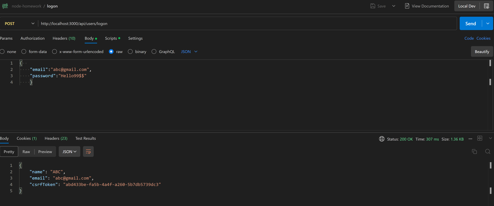
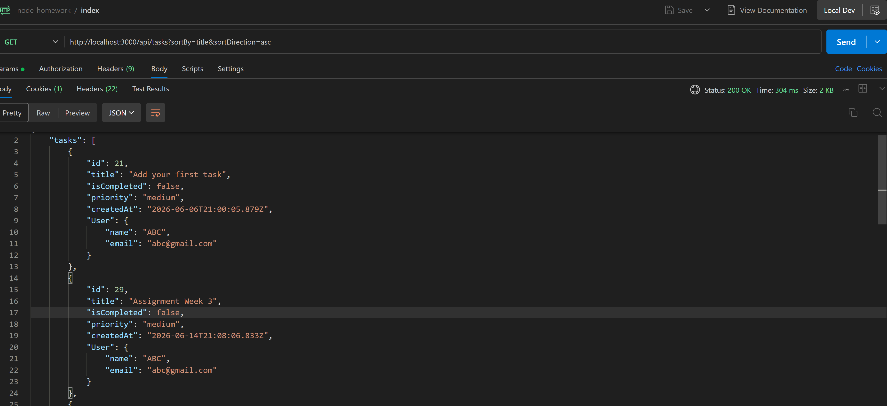
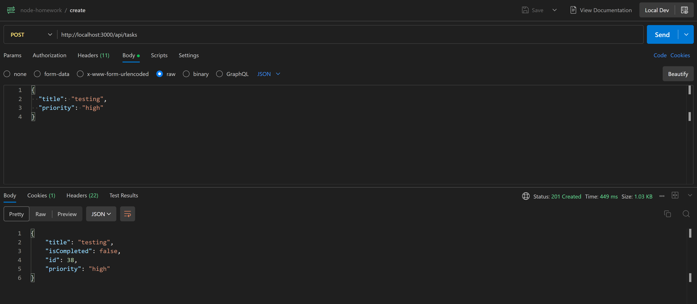
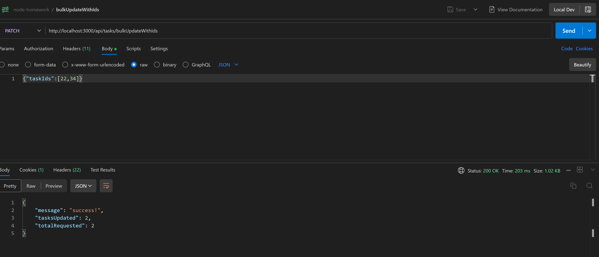
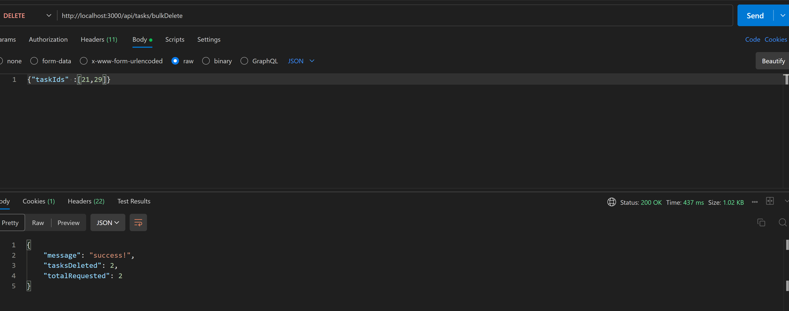

# TASK MANAGEMENT APP

Task Management App is a full stack application built with React, Node Js, Express Js and Prisma. This app facilitate the users to register, login securely to the application. Users can perform create ,update, delete and organize tasks with authentication and secure API's. Additionally, the application supports Google login, allowing users to authenticate securely using their Google accounts.

## FEATURES

- Register and Login Users
- User authentication (JWT + coookies)
- Google Logon using google Oauth2.0
- Create, update, delete tasks
- Bulk Create, Bulk Update, Bulk Delete tasks
- Pagination Support
- Analytical User Task Support
- Secure API with middleware validation
- Schema validation using JOI
- Data Management using Prisma
- Testing using Jest

## TECH STACK

Frontend:

- React
- Vite

Backend:

- Node.js
- Express.js

Database:

- PostgreSQL
- Prisma ORM

Testing:

- Jest

Validation:

- JOI

## PROJECT STRUCTURE

| Folder         | Purpose                                            |
| -------------- | -------------------------------------------------- |
| `controllers/` | Logic for API endpoints                            |
| `routes/`      | Application routes                                 |
| `middleware/`  | Authentication, JWT validation, and error handling |
| `schemas/`     | Joi validation schemas                             |
| `prisma/`      | Database schema and migrations                     |
| `tests/`       | test cases using jest                              |
| `tdd/`         | test cases using jest for all weekly assignments   |
| `validation/`  | schema validation using JOI                        |

```

```

## INSTALLATION & SETUP

### 1. Clone the repo

Backend:
git clone https://github.com/Theera12/node-homework

### 2. Install dependencies

Backend:
npm install

### 1. Clone the repo

Frontend:
git clone https://github.com/Code-the-Dream-School/node-essentials-front-end

### 2. Install dependencies

Frontend:
npm install

## ENVIRONMENT VARIABLE

### Create a `.env` file in the BACKEND folder:

DATABASE_URL=your_postgres_url
JWT_SECRET=your_secret
RECAPTCHA_SECRET=your_secret
RECAPTCHA_BYPASS=your_bypass
GOOGLE_CLIENT_ID =your_google_client_id
GOOGLE_CLIENT_SECRET=your_client_secret
GOOGLE_REDIRECT_URI=http://localhost:3001

### Create a `.env` file in the Frontend folder:

VITE_BASE_URL=""
VITE_TARGET="http://localhost:3000"
#VITE_TARGET="https://node-homework-909.onrender.com"
VITE_RECAPTCHA_SITE_KEY=your_recaptcha_site_key
VITE_GOOGLE_CLIENT_ID =your_google_client_id

## RUN THE PROJECT LOCALLY

Backend:
npm run dev

Frontend:
npm run dev

## API Endpoints

### User Authentication

POST /api/users/register  
POST /api/users/login  
POST /api/users/googleLogon  
GET /api/users/:id
POST /api/users/logoff

### Tasks

GET /api/tasks?sortBy=title&sortDirection=asc  
POST /api/tasks  
PATCH /api/tasks/:id  
GET /api/tasks/:id  
DELETE /api/tasks/:id

### Bulk

POST/api/tasks/bulk
PATCH /api/tasks/bulkDelete
DELETE /api/tasks/bulkUpdateWithIds

### ANALYTICS

GET/api/users/:id
GET/api/users
GET/api/tasks/search

## SECURITY FEATURES

- HTTP-only cookies for JWT
- CSRF protection using tokens
- Input validation using Joi
- Rate limiting & Helmet security headers

## TESTING

npm run test

## API Testing (Postman)

All backend APIs were tested using Postman.

### Authentication




### Task Operations




### Bulk Operations




### Analytics


## DEPLOYMENT

Backend: Render  
Deployed Backend: https://node-homework-909.onrender.com/
Database: Neon

## CREDITS

This project was built as part of the Code the Dream (CTD) training program.  
I would like to thank CTD for their mentorship, curriculum, and support in helping me build full-stack development skills.

## AUTHOR

Aarthy Mayakrishnan
GitHub: https://github.com/Theera12
